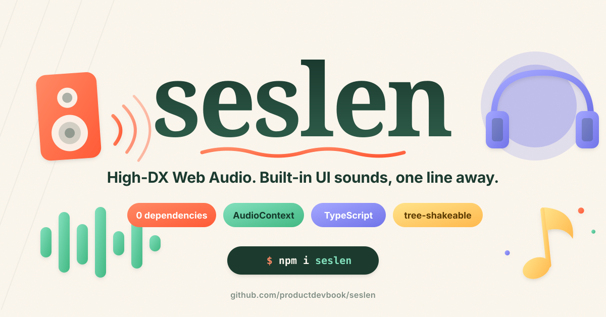

<p align="center">
  
</p>

<h1 align="center">seslen</h1>

<p align="center">
  <strong>High-DX Web Audio.</strong> A small, ergonomic API on top of <code>AudioContext</code> with built-in, <em>synthesised</em> UI sound presets.
</p>

<p align="center">
  <a href="https://www.npmjs.com/package/seslen"></a>
  <a href="https://bundlephobia.com/package/seslen"></a>
  <a href="./LICENSE"></a>
</p>

> [!WARNING]
> `seslen` is under active development. The API may break between 0.x releases.

## Why seslen?

`AudioContext` is powerful but low-level: context unlock, decode, cache, gain, source lifetime, polyphony, ducking — all manual. **`seslen`** wraps that in a one-line API and ships with **synthesised** UI presets (no audio files, no network, no decode):

```ts
import { createSeslen } from "seslen"
import { presets } from "seslen/presets"

const ses = createSeslen({ sources: presets })

await ses.play("victory") // play a preset
await ses.play("tick", { gain: 0.4 }) // gain / rate / detune / pan / fades / jitter
const handle = await ses.play("ambient", { loop: true })
handle?.fadeTo(0, 0.4) // ramp gain → 0 over 400 ms
handle?.stop()
```

## Features

- 🪶 **Zero dependencies**, pure ESM, tree-shakeable
- 🎹 **36 synthesised presets** — every play generated fresh on `AudioContext`
- ⚡ **Lazy AudioContext** — created only on the first `play()`
- 🔓 **Auto-unlock** — resumes the context on the first user gesture
- ♿️ **Respects `prefers-reduced-motion`** — auto-mutes by default
- 💾 **`localStorage` persistence** for master volume + mute
- 🎛 **Per-call options** — `gain`, `rate`, `detune`, `loop`, `pan`, `fadeIn`, `fadeOut`, `when`, `sprite`, `interrupt`
- 🌀 **Jitter** — `rateJitter` / `gainJitter` / `detuneJitter` so 100 ticks don't sound like 1 tick repeated
- 🚦 **Throttle** per call — drop rapid-fire repeats inside a window
- 🎚 **Polyphony cap** — per-source `voices` + `steal: "oldest" | "newest" | "drop"`
- 🚌 **Buses** — named sub-mixers with their own `volume` / `mute` and **ducking** (sidechain)
- ⏱ **Sample-accurate scheduling** — `play(name, { when: ses.now() + 0.25 })`
- 🪄 **Single-flight cache** for URL sources — decoded only once
- 🧱 **Three source types** — URL, `AudioBuffer`, or your own `SoundFactory`
- 📼 **Render to WAV** via `OfflineAudioContext` — `await ses.render("victory")`
- 📈 **Analyser tap** — `ses.analyser({ fftSize })` for waveforms / spectra
- 🛡 **SSR-safe** — every method is a typed no-op via `seslen/server`
- 🔡 **Strict TypeScript** — `verbatimModuleSyntax`, `isolatedModules`

## Install

```bash
npm install seslen
# pnpm add seslen
# yarn add seslen
# bun add seslen
```

## Quick start

### 1) Use the built-in presets

```ts
import { createSeslen } from "seslen"
import { presets, presetDefaults } from "seslen/presets"

const ses = createSeslen({
  sources: presets,
  defaults: presetDefaults, // per-preset jitter, throttle, voices
  volume: 0.8,
  persist: "seslen:master", // round-trip volume/mute through localStorage
})

button.addEventListener("click", () => ses.play("tick"))
form.addEventListener("submit", () => ses.play("success"))
```

### 2) Register a remote URL (with a sprite)

```ts
const ses = createSeslen({
  sources: { ui: "/sounds/ui-pack.mp3" },
})
await ses.play("ui", { sprite: [0, 0.08], gain: 0.6, rate: 1.2 })
```

### 3) Register your own `SoundFactory`

```ts
import { createSeslen, type SoundFactory } from "seslen"

const blip: SoundFactory = (ctx, master, opts) => {
  const t = ctx.currentTime
  const o = ctx.createOscillator()
  const g = ctx.createGain()
  o.frequency.setValueAtTime(880, t)
  g.gain.setValueAtTime(0.0001, t)
  g.gain.linearRampToValueAtTime(0.1 * (opts.gain ?? 1), t + 0.005)
  g.gain.exponentialRampToValueAtTime(0.0001, t + 0.12)
  o.connect(g).connect(master)
  o.start(t)
  o.stop(t + 0.14)
  let stopped = false
  return {
    stop() {
      stopped = true
      try {
        o.stop()
      } catch {}
    },
    get done() {
      return stopped
    },
    get duration() {
      return 0.14
    },
    onEnded() {},
  }
}

const ses = createSeslen({ sources: { blip } })
await ses.play("blip")
```

### 4) Buses + ducking

```ts
const ses = createSeslen({
  sources: presets,
  buses: { ui: {}, music: { volume: 0.6 } },
})

const music = await ses.play("ambient", { bus: "music", loop: true })

// Sidechain music down to 20% for 500 ms whenever the UI fires.
ses.on("play", (e) => {
  if (e.name !== "@pattern") ses.bus("music").duck({ target: 0.2, holdSeconds: 0.5 })
})
```

### 5) Throttle, jitter, interrupt — for sounds that fire often

```ts
// Hover sound: cap repeats, vary pitch slightly, never overlap with itself.
await ses.play("hover", {
  throttle: 40, // drop calls inside 40 ms
  rateJitter: 0.05, // ±5% pitch variation
  detuneJitter: 30, // ±30 cents
  interrupt: true, // stop any prior hover instance
})
```

### 6) Schedule a sequence

```ts
await ses.playPattern([
  { id: "tick" },
  { at: 80, id: "tick", options: { gain: 0.5 } },
  { at: 160, id: "success" },
])

// Sample-accurate one-off:
await ses.play("notify", { when: ses.now() + 0.25 })
```

### 7) Render a preset to a WAV file

```ts
const wav = await ses.render("victory", { durationSeconds: 1.5 })
const url = URL.createObjectURL(wav)
// download / share / preview
```

### 8) Visualise the master signal

```ts
const tap = ses.analyser({ fftSize: 256 })
const data = new Uint8Array(tap.fftSize / 2)
function frame() {
  tap.getSpectrum(data) // 0..255 per bin
  // draw bars …
  requestAnimationFrame(frame)
}
frame()
```

## API

### `createSeslen(opts?: SeslenOptions): SeslenInstance`

| option                 | type                                                   | default | description                                                  |
| ---------------------- | ------------------------------------------------------ | ------- | ------------------------------------------------------------ |
| `sources`              | `Record<string, SoundSource>`                          | `{}`    | Name → URL, `AudioBuffer`, or `SoundFactory`                 |
| `defaults`             | `Partial<Record<string, SourceDefaults>>`              | `{}`    | Per-source jitter / throttle / voices / steal / bus defaults |
| `volume`               | `number` (0..1)                                        | `1`     | Master gain                                                  |
| `buses`                | `Record<string, { volume?: number; muted?: boolean }>` | `{}`    | Pre-declared named buses                                     |
| `maxVoices`            | `number`                                               | —       | Global voice cap across all sources                          |
| `respectReducedMotion` | `boolean`                                              | `true`  | Auto-mute when `prefers-reduced-motion: reduce` is set       |
| `persist`              | `string`                                               | —       | `localStorage` key for master volume + mute persistence      |
| `preload`              | `boolean`                                              | `false` | Preload every URL source on first user gesture               |

### `SeslenInstance`

| method                              | returns                                                      | description                                                      |
| ----------------------------------- | ------------------------------------------------------------ | ---------------------------------------------------------------- |
| `play(name, opts?)`                 | `Promise<PlayHandle \| null>`                                | Play a sound. Returns `null` if throttled or dropped             |
| `playPattern(steps)`                | `Promise<PlayHandle>`                                        | Schedule a timed sequence; combined handle stops every step      |
| `preload(name)`                     | `Promise<void>`                                              | Fetch + decode (URL sources only)                                |
| `stop(name)`                        | `number`                                                     | Stop every active handle for one preset; returns the count       |
| `stopAll()`                         | `void`                                                       | Stop every active `PlayHandle`                                   |
| `register(name, src, defs?)`        | `void`                                                       | Add or replace a source (with optional defaults)                 |
| `unregister(name)`                  | `boolean`                                                    | Remove a source; stops live handles for that name                |
| `has(name)` / `names()`             | `boolean` / `string[]`                                       | Registry introspection                                           |
| `getVolume()` / `setVolume()`       | `number` / `void`                                            | Master gain accessors (clamped 0..1)                             |
| `mute()` / `unmute()` / `isMuted()` | —                                                            | Master mute toggle                                               |
| `bus(name)`                         | `BusHandle`                                                  | Get or create a named sub-mixer (`getVolume`, `mute`, `duck`, …) |
| `now()` / `latency()`               | `number` / `number`                                          | `AudioContext.currentTime` / `baseLatency + outputLatency`       |
| `render(name, opts?)`               | `Promise<Blob>`                                              | Render a sound to a 16-bit PCM WAV via `OfflineAudioContext`     |
| `analyser(opts?)`                   | `AnalyserTap`                                                | Tap an `AnalyserNode` for waveform / spectrum data               |
| `on(type, fn)` / `off()`            | `() => void` / `void`                                        | Subscribe to `play` / `ended` / `throttled` / `statechange`      |
| `pause()` / `resume()`              | `Promise<void>`                                              | Suspend / resume the underlying context                          |
| `close()`                           | `Promise<void>`                                              | Close the `AudioContext`, clear caches, drop analyser            |
| `isReady()` / `state()`             | `boolean` / `"idle" \| "running" \| "suspended" \| "closed"` | Lifecycle inspection                                             |

### `PlayOptions`

| field          | type                 | default | description                                                      |
| -------------- | -------------------- | ------- | ---------------------------------------------------------------- |
| `gain`         | `number`             | `1`     | Linear gain (0..1)                                               |
| `rate`         | `number`             | `1`     | Playback rate (URL/`AudioBuffer` sources)                        |
| `detune`       | `number`             | `0`     | Detune in cents                                                  |
| `loop`         | `boolean`            | `false` | Loop until `stop()` is called                                    |
| `pan`          | `number` (-1..1)     | `0`     | Stereo pan via `StereoPannerNode`                                |
| `fadeIn`       | `number` (seconds)   | `0`     | Linear ramp in from silence                                      |
| `fadeOut`      | `number` (seconds)   | `0`     | Linear ramp to silence on `stop()`                               |
| `when`         | `number` (seconds)   | `0`     | Schedule start at `currentTime + when` (use `ses.now()`)         |
| `sprite`       | `[offset, duration]` | —       | Slice of a buffer source                                         |
| `interrupt`    | `boolean`            | `false` | Stop every prior instance of the same sound first                |
| `throttle`     | `number` (ms)        | `0`     | Drop the call if the same sound was triggered inside this window |
| `rateJitter`   | `number` (0..1)      | `0`     | ± random multiplier applied to `rate`                            |
| `gainJitter`   | `number` (0..1)      | `0`     | ± random multiplier applied to `gain`                            |
| `detuneJitter` | `number` (cents)     | `0`     | ± random offset applied to `detune`                              |
| `bus`          | `string`             | —       | Route through a named bus instead of master                      |

### `PlayHandle`

```ts
interface PlayHandle {
  stop(): void
  readonly done: boolean
  readonly duration: number | null
  onEnded(cb: () => void): void
  fadeTo?(value: number, seconds: number): void
  setGain?(value: number): void
  rampRate?(value: number, seconds: number): void
}
```

### `SourceDefaults`

Set per-preset defaults via `createSeslen({ defaults })` or `register(name, source, defaults)`. Any per-call `PlayOptions` override these.

```ts
interface SourceDefaults {
  gain?: number
  rate?: number
  detune?: number
  pan?: number
  rateJitter?: number
  gainJitter?: number
  detuneJitter?: number
  minInterval?: number // throttle ms
  voices?: number // polyphony cap
  steal?: "oldest" | "newest" | "drop"
  bus?: string
}
```

### `BusHandle`

```ts
interface BusHandle {
  readonly name: string
  getVolume(): number
  setVolume(value: number): void
  mute(): void
  unmute(): void
  isMuted(): boolean
  duck(opts: {
    target: number
    holdSeconds: number
    attackSeconds?: number
    releaseSeconds?: number
  }): void
}
```

### `SoundFactory`

```ts
type SoundFactory = (ctx: AudioContext, destination: AudioNode, opts: PlayOptions) => PlayHandle
```

The `destination` is a bus or the master gain — connect your last node to it.

## Built-in presets

```ts
import { presets, presetEntries, presetDefaults, presetTags } from "seslen/presets"
```

`presets` is the plug-and-play factory map for `createSeslen`. `presetEntries` carries the same factories with metadata (label, description, tags, recipe, motion hint, accent colour, author, defaults). `presetDefaults` is the per-preset jitter/throttle/voices map — pass it to `createSeslen({ defaults })` for sensible baselines. `presetTags` is the deduplicated tag union.

### Original eight

| name      | tags                         | recipe                            |
| --------- | ---------------------------- | --------------------------------- |
| `tick`    | `ui` `feedback` `click`      | sine 4 kHz · 3 ms                 |
| `success` | `feedback` `success` `chirp` | triangle 660→1320 Hz · 320 ms     |
| `error`   | `feedback` `error`           | square 220→150 Hz · 260 ms        |
| `warning` | `feedback` `warning`         | square 880↔660 Hz · 500 ms        |
| `message` | `notification` `bell`        | sine 880 + 1320 Hz · 420 ms       |
| `add`     | `ui` `feedback` `chirp`      | sine 880→1480 Hz · 140 ms         |
| `delete`  | `ui` `noise` `sweep`         | noise sweep 4 kHz→400 Hz · 200 ms |
| `victory` | `game` `success` `arpeggio`  | C-E-G-C arpeggio · 360 ms         |

### UI feedback

| name          | tags                     | recipe                              |
| ------------- | ------------------------ | ----------------------------------- |
| `hover`       | `ui` `hover`             | sine 2.4 kHz · 25 ms                |
| `pop`         | `ui` `feedback`          | triangle 1200→320 Hz · 90 ms        |
| `swoosh`      | `ui` `noise` `sweep`     | noise bandpass 400→4000 Hz · 240 ms |
| `toggle-on`   | `ui` `feedback` `toggle` | sine 700 + 1100 Hz · 110 ms         |
| `toggle-off`  | `ui` `feedback` `toggle` | sine 1100 + 700 Hz · 110 ms         |
| `notify`      | `notification` `chirp`   | sine 660-880-1320 Hz · 360 ms       |
| `keypress`    | `ui` `click` `keyboard`  | square 1.8 kHz · 12 ms              |
| `scroll-tick` | `ui` `click`             | triangle 3 kHz · 6 ms               |
| `drag`        | `ui` `drag`              | sine 440→660 Hz · 120 ms            |
| `drop`        | `ui` `drag`              | sine 220→110 Hz · 120 ms            |
| `expand`      | `ui` `transition`        | sine 330→990 Hz · 200 ms            |
| `collapse`    | `ui` `transition`        | sine 990→330 Hz · 200 ms            |
| `undo`        | `ui` `feedback`          | triangle 880→520 Hz · 180 ms        |
| `redo`        | `ui` `feedback`          | triangle 520→880 Hz · 180 ms        |
| `send`        | `ui` `noise` `sweep`     | noise highpass 600→4000 Hz · 220 ms |
| `receive`     | `notification` `chirp`   | sine 1320→880 Hz · 220 ms           |
| `copy`        | `ui` `feedback`          | sine 1480 + 1480 Hz · 90 ms         |
| `paste`       | `ui` `feedback`          | sine 880 Hz · 80 ms                 |

### Game / playful

| name        | tags                        | recipe                               |
| ----------- | --------------------------- | ------------------------------------ |
| `level-up`  | `game` `success` `arpeggio` | C-D-E-G-C arpeggio · 480 ms          |
| `coin`      | `game` `pickup`             | square 988 + 1320 Hz · 180 ms        |
| `jump`      | `game`                      | square 220→880 Hz · 100 ms           |
| `shoot`     | `game` `noise`              | noise bandpass 5 kHz→500 Hz · 130 ms |
| `explosion` | `game` `noise`              | noise lowpass 2 kHz→100 Hz · 600 ms  |

### Ambient / state

| name         | tags                    | recipe                                |
| ------------ | ----------------------- | ------------------------------------- |
| `heartbeat`  | `ambient` `rhythm`      | sine 60 Hz double-thump · 600 ms      |
| `alarm`      | `feedback` `warning`    | square 880↔660 Hz · 4 cycles · 800 ms |
| `typewriter` | `ui` `click`            | triangle 2.6 kHz · 8 ms               |
| `lock`       | `ui` `feedback` `click` | square 320 + 220 Hz · 140 ms          |
| `unlock`     | `ui` `feedback` `click` | triangle 220 + 440 Hz · 140 ms        |

## Contributing presets

PRs that add new presets are very welcome. Every preset is one self-contained file under [`src/presets/`](./src/presets/) with a metadata header — see [`src/presets/CONTRIBUTING.md`](./src/presets/CONTRIBUTING.md) for a 30-line template and review checklist.

The Vite/Tailwind playground in [`web/`](./web/) auto-detects every preset, with search + tag filters — your contribution shows up the moment it's wired into `presets/index.ts`.

## SSR

```ts
// server.ts
import { createSeslen } from "seslen/server"
const ses = createSeslen() // every method is a typed no-op
```

## Errors

```ts
import { SeslenError, ContextNotReadyError, DecodeError, LoadError } from "seslen"
```

`SeslenError` is the base. Use `instanceof` for targeted recovery.

## Auto-unlock + accessibility

Browsers keep `AudioContext` `suspended` until a user gesture. `seslen` calls `resume()` on the first `pointerdown` / `keydown` / `touchstart`, then detaches the listeners — you never deal with it.

When the user has `prefers-reduced-motion: reduce`, `seslen` auto-mutes the master bus (this is the default — opt out with `respectReducedMotion: false`). The setting is re-evaluated live.

## License

[MIT](./LICENSE) © [productdevbook](https://github.com/productdevbook)

---

### 💖 Support

If `seslen` saves you engineering time, consider [sponsoring on GitHub](https://github.com/sponsors/productdevbook).
